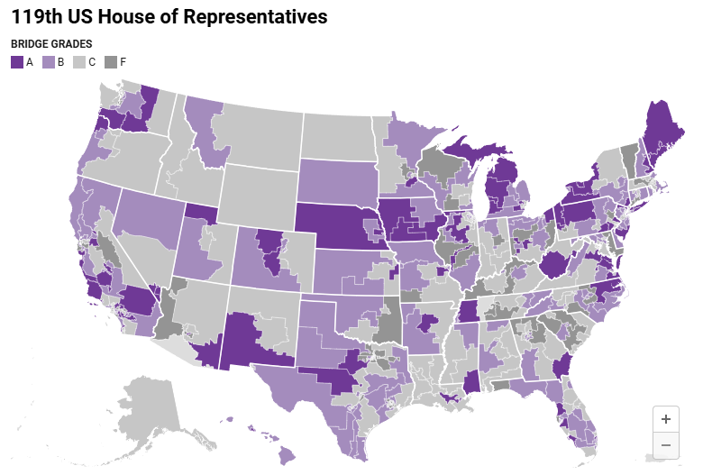

# **Introduction**

```{admonition} What is Bridge Grades?
:class: tip

**Bridge Grades for Congress** is like Rotten Tomatoes for politicians—a data-driven, transparent grading system that scores members of Congress on their ability to bridge America through collaboration, coalition-building, and consensus solutions.

Unlike traditional political scoring systems that focus on ideology or party loyalty, Bridge Grades measures **how** politicians behave rather than **what** they believe. Using objective, third-party data, we evaluate observable behaviors including:

- **Legislative record**: Bill authoring, sponsorship, and bipartisan effectiveness
- **Public rhetoric**: Statements, speeches, and social media communications
- **Collaboration patterns**: Cross-party alliances and coalition building
- **Civility**: Unifying versus divisive discourse
```

## **The Bridge Grades System**

Every House Representative and Senator receives a **Bridge Grade** (A, B, C, or F) for each term they serve:

- **A & B grades** = **Bridgers** (top half of the class)
- **C & F grades** = **Dividers** (bottom half of the class)

These grades are calculated using a 100-point scoring system that aggregates data from six trusted public sources, measuring four key collaboration dimensions:

1. **Consensus Solutions**: Bipartisan legislation and problem-solving
2. **Coalition Building**: Cross-party alliances and collaborative governance
3. **Civil Discourse**: Unifying versus divisive rhetoric
4. **Courage**: Bridging behavior even in partisan districts

### **Visualizing Bridge Grades Across America**

Below is a map showing the distribution of Bridge Grades across all 435 congressional districts in the 119th US House of Representatives. This visualization demonstrates how collaboration and bipartisanship are distributed geographically across the United States:



*Map showing Bridge Grades (A, B, C, F) for congressional districts across the United States. Dark purple represents Grade A (highest collaboration), lighter purple represents Grade B, light gray represents Grade C, and dark gray represents Grade F (lowest collaboration).*

## **Why Bridge Grades Matter?**

America faces a critical challenge: **toxic polarization** that undermines our democratic institutions. The data tells a compelling three-part story:

### **1. The Partisan Gap**
Political bodies have become significantly more partisan than the voters they represent. Over the past 40 years, the ideological gap within the U.S. House of Representatives has widened dramatically, eroding the art of cross-party collaboration.

### **2. The Independent Majority**
According to June 2024 Gallup polling, **43% of Americans identify as independent**, while only 28% consider themselves straight Republicans or Democrats respectively. This represents a 20-year trend toward political independence. These under-represented voters vote less frequently and contribute fewer campaign dollars, ceding political power to ideological extremes.

### **3. Public Frustration**
The Georgetown Civility Poll reveals that Americans overwhelmingly agree democracy isn't working well, with both sides blaming the extreme elements of the opposite party. However, there's hope: **88% of respondents (72% strongly) believe leaders finding compromises together can help lower political division**.

## **A New Approach to Politics**

America was designed as a plural society—*E pluribus unum* (From many, one). The founding vision embraced peaceful coexistence within a society that accepts diverse ideas, interests, and beliefs while agreeing to disagree.

Today, American politics has devolved into a 24/7 national sports rivalry where voters choose candidates based solely on their "team colors." Bridge Grades offers an alternative: **choosing representatives based on their ability to collaborate and solve problems for our common interests**.

## **The Methodology**

### **Bridge Grades: What we measure**
In collaboration with Masters candidates at Indiana University and student volunteers, the Bridge Grades systems are built and calibrated to sort legislative “bridgers” from “dividers” independent of ideology.

- **Bridgers**  build win-win consensus solutions through collaboration and coalitions for the benefit of bipartisan interests.

- **Dividers** pursue zero-sum game governance, engage in personal attacks, and demonstrate predictably partisan legislative records. 

Bridge Grades are calculated using public data from trusted 3rd party sources that measure observable behaviors including what a person says (**rhetoric:** public statements, speeches, social media), and what a person does (**legislative record:** authoring and sponsoring bipartisan bills).

We aggregate objective public data along four core collaboration dimensions:

- **Consensus solutions** (legislative record: cross party legislation)
- **Civil discourse** (bipartisan rhetoric, dividing rhetoric)
- **Courage** (bridging even when it would be easier not to)
- **Coalition building** (legislative record: cross party alliances)


### **How we calculate Bridge Grades: the process**

1. Aggregate datasets from multiple public sources for each member of Congress on their legislative records and rhetoric.
2. Normalize datasets to a 0-100 range.
3. Apply weights to each normalized dataset (what you do counts more than what you say).
4. Sum the totals of the weighted scores.
5. Apply degree-of-difficulty based courage bonuses to reward bridging by those with wide ideologies and who represent hard leaning partisan districts.
6.  (House only) Add bonus for members of the bipartisan Problem Solvers Caucus.
7.  Normalize the final totals into a 0-100 scale (the Bridge Score)
8.  Apply a forced grading curve and assign Bridge Grades for each member. The top 50% (bridgers) earn As and Bs, while the bottom half (dividers) earn Cs and Fs. One standard deviation away from the mean are As and Fs.

## **Think of It Like Restaurant Grades**

Just as municipal health departments provide "Sanitary Inspection Grades" to help diners make informed choices about restaurant hygiene, Bridge Grades serve as **sanitation grades for politicians**—helping voters identify representatives who can effectively govern through collaboration rather than division.

```{admonition} About This Documentation
:class: tip

This documentation website will walk you through exactly how Bridge Grades are calculated, providing transparency into our methodology and data sources. Whether you're a researcher, journalist, voter, or policymaker, these pages will help you understand the science behind identifying legislative bridgers and dividers.
```

```{note}
**Official Website**: Learn more at [bridgepledge.org](https://www.bridgepledge.org/)
```

