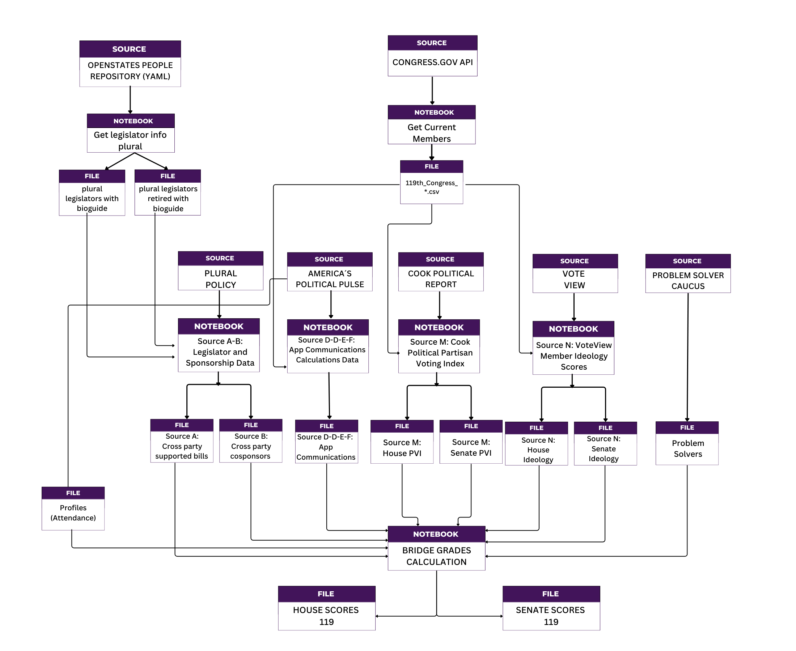

# **About Bridge Grades Project**
## **Bridge Grades Data Pipeline Overview**

### **Project Philosophy**

Bridge Grades is built on four core principles that guide every aspect of our methodology:

- **Non-ideological:** Focus on behavior, not beliefs
- **Data-driven:** Based on observable legislative actions  
- **Transparent:** Derived from public, verifiable sources
- **Comprehensive:** Capture multiple dimensions of collaboration

These principles ensure that Bridge Grades measures **how** politicians behave rather than **what** they believe, providing objective assessments of bipartisan collaboration that transcend partisan divides.

### **Data Pipeline Architecture**

The Bridge Grades methodology follows a systematic data pipeline that transforms raw congressional data into meaningful collaboration grades. The pipeline consists of three main stages:

```{admonition} Stage 1: Data Preprocessing Notebooks
:class: tip

**Purpose:** Transform raw data sources into standardized, analysis-ready datasets
Each preprocessing notebook takes one or more raw data sources and converts them into the specific metrics needed for Bridge Grade calculations. These notebooks handle data cleaning, standardization, and initial metric calculations.
```

```{admonition} Stage 2: Data Integration and Scoring
:class: tip

**Purpose:** Combine all processed datasets and calculate final Bridge Grades

The main scoring engine takes all preprocessed datasets and applies the Bridge Grades algorithm to generate final letter grades (A, B, C, F) for each member of Congress.
```
```{admonition} Stage 3: Output and Analysis
:class: tip

**Purpose:** Generate final results and provide transparency into the scoring process

Final datasets include complete scoring breakdowns, allowing users to understand exactly how each Bridge Grade was calculated.
```

### **Notebook Structure and Data Flow**



#### **Base Data Collection Notebooks**

##### **Current Legislators Data Collection**
- **Purpose:** Generate master legislator roster from official sources
- **Input:** Congress.gov API and OpenStates repository
- **Process:** Collects current member information and bioguide_id mappings
- **Output:** Master legislator datasets with unique identifiers
- **Bridge Grades Impact:** Provides essential legislator identification for all subsequent processing

#### **Preprocessing Notebooks (Data Sources A-P)**

##### **Source A-B: Legislator and Sponsorship Data Processing**
- **Input:** Raw bill sponsorship data from Plural Policy
- **Process:** Identifies bills with cross-party cosponsorship and calculates collaboration metrics
- **Output:** Two key datasets:
  - Source A: Authors of bills with cross-party sponsors
  - Source B: Legislators who cosponsor bills from the opposite party
- **Bridge Grades Impact:** Core legislative collaboration metrics (suggested weights: A=3.0, B=2.0)

#####  **Source C-D-E-F: APP Communications Calculations**
- **Input:** Public communication data from Americas Political Pulse
- **Process:** Analyzes rhetoric patterns for bipartisanship and personal attacks
- **Output:** Four communication metrics:
  - Source C: Bipartisan communication sum
  - Source D: Bipartisan communication percentage
  - Source E: Personal attack sum
  - Source F: Personal attack percentage
- **Bridge Grades Impact:** Measures public rhetoric and communication style (suggested weights: 1.0 each)

##### **Source M: Cook Political PVI Processing**
- **Input:** Partisan Voting Index data from Cook Political
- **Process:** Measures district/state partisan lean for "degree of difficulty" adjustment
- **Output:** PVI scores for all congressional districts and states
- **Bridge Grades Impact:** Bonus for rewarding bridging in highly partisan districts 

##### **Source N: VoteView Ideology Scores**
- **Input:** Ideological positioning data from VoteView
- **Process:** Calculates distance from ideological center
- **Output:** Ideology distance scores for all members
- **Bridge Grades Impact:** Bonus for rewarding bridging by non-centrist legislators 

##### **Source P: Problem Solvers Caucus “Bump”**

* **Input:** Membership list of the Problem Solvers Caucus (PSC) from [problemsolverscaucus.house.gov](https://problemsolverscaucus.house.gov/caucus-members)
* **Process:** Flags each legislator by bioguide ID and applies a fixed points boost (`ps_score`) to their pledge score
* **Output:** `P_flag` (0 or 1)
* **Bridge Grades Impact:** Bonus for rewarding participation of PSC members

### **Main Scoring Engine**

#### **Bridge_Pledge_119: Final Bridge Grade Calculation**
- **Input:** All preprocessed datasets (Sources A-P) plus attendance data
- **Process:** 
  1. Applies attendance filtering (removes members below 20% attendance)
  2. Integrates all data sources using bioguide_id matching
  3. Normalizes all metrics to 0-100 scale using statistical distributions
  4. Applies configurable weights to each source
  5. Calculates composite scores with ideology multipliers
  6. Assigns letter grades using statistical thresholds
- **Output:** Complete scoring datasets for House and Senate members
- **Key Features:**
  - Configurable source weights
  - Problem Solvers Caucus bonus
  - Statistical grade assignment (A/B/C/F)
  - Complete transparency in scoring breakdown

### **Key Principles in Practice**

```{admonition} Non-Ideological Focus
:class: tip
- **What We Measure:** Legislative collaboration, bill sponsorship, communication patterns
- **What We Don't Measure:** Political beliefs, policy positions, voting ideology
- **Implementation:** Sources M and N use ideology only as context multipliers, not direct scoring factors
```
```{admonition} Data-Driven Methodology
:class: tip
- **Observable Behaviors:** All metrics based on concrete actions (sponsoring bills, making statements, voting)
- **Public Records:** Every data point traceable to official congressional records
- **Statistical Rigor:** Normalization and threshold-based grading eliminate subjective judgments
```
```{admonition} Transparency
:class: tip
- **Complete Traceability:** Every score component preserved in output files
- **Open Data Sources:** All primary data publicly accessible
- **Configurable Weights:** All source weights can be adjusted and documented
- **Methodology Disclosure:** Full documentation of algorithms and processes
```
```{admonition} Comprehensive Coverage
:class: tip
- **Multiple Dimensions:** Legislative action, public communication, district context
- **Both Chambers:** House and Senate processed separately with appropriate adjustments
- **Full Congress:** All members included (subject to attendance requirements)
- **Balanced Metrics:** Both positive (collaboration) and negative (attacks) behaviors measured
```

### **Quality Assurance and Validation**

1.  **Data Quality Checks**
- **Attendance Filtering:** Removes members with insufficient participation
- **Missing Data Handling:** Appropriate filling strategies for each data type
- **Duplicate Removal:** Systematic handling of duplicate records
- **Outlier Detection:** Statistical validation of extreme values

2.  **Methodology Validation**
- **Cross-Reference Checks:** Multiple sources validate legislator identification
- **Statistical Consistency:** Regular validation of scoring distributions
- **Transparency Audits:** Periodic reviews of methodology and outputs
- **User Feedback Integration:** Continuous improvement based on stakeholder input

3.  **Update and Maintenance**
- **Regular Data Updates:** Monthly to annual refresh cycles depending on source
- **Version Control:** Complete tracking of methodology changes
- **Backup and Recovery:** Robust data storage and processing systems
- **Documentation Maintenance:** Continuous updates to reflect current methodology

### **Bridge Grades Impact**
 #### **For Voters**
- **Objective Assessment:** Clear, data-driven evaluation of congressional collaboration
- **Transparent Methodology:** Complete understanding of how grades are calculated
- **Actionable Information:** Identifies "bridgers" vs "dividers" for informed voting

 #### **For Legislators**
- **Performance Feedback:** Clear metrics on collaboration effectiveness
- **Incentive Alignment:** Rewards bipartisan behavior regardless of ideology
- **Recognition System:** Acknowledges Problem Solvers Caucus and other collaborative efforts

 #### **For Democracy**
- **Polarization Reduction:** Encourages collaboration over division
- **Accountability:** Public scoring creates pressure for bipartisan engagement
- **Transparency:** Open methodology builds trust in the evaluation process
- **Evidence-Based Reform:** Data-driven insights for improving congressional function
